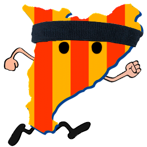

# [PES: CATRUN] README #

### CATRUN Icon ####

### Equip ###

| Nom | Rol | Email de contacte |
| :---: |:---:|:-----------------:|
| Bejar, Romà | Developer team | roma.bejar@gmail.com |
| Costal, Jordi | Developer team | jordi.costal94@gmail.com |
| Escoz, Rafa | Responsable Sprint 1 | rafescas94@gmail.com |
| Fernández, Victor | Developer team | victorfernandezramajo@gmail.com |
| Mora, Germán | Responsable (Fag-1) | german.mora1989@gmail.com |
| Ortiz, Joshua | Responsable (Fag-2) | joshua.og@gmail.com |
| Vives, Maria | Developer team | mariav355@gmail.com | 

[Versió extesa amb usuaris de Gdrive, Taiga i Bitbucket](https://bitbucket.org/rafescas/pes-catrun-repository/src/master/documentation/membresEquip.md)

### Enllaços importants ###

- [ Project Record Track ](https://docs.google.com/spreadsheets/d/1GEikL9t-79Y3tkhd6CoQjhBESNEL-w3dqfzCU6kQ3Kk/edit?usp=sharing)
- [ Taiga ](https://tree.taiga.io/project/edum17-pes/)
- [ Bitbucket ](https://bitbucket.org/rafescas/pes-catrun-repository)
- [ Metodologia de Treball ](https://bitbucket.org/rafescas/pes-catrun-repository/src/master/documentation/metodologiaDeTreball.md)
- [ Changelog ](https://bitbucket.org/rafescas/pes-catrun-repository/src/master/documentation/Changelog.md)

## Index ##

##### Entrega Fag-1 #####

1. [ Visió del Projecte ](https://bitbucket.org/rafescas/pes-catrun-repository/src/master/documentation/fag-1/visioDelProjecte.md)
2. [ Característiques del Sistema ](https://bitbucket.org/rafescas/pes-catrun-repository/src/master/documentation/fag-1/CaracteristiquesDelSistema.md)
3. [ Not List ](https://bitbucket.org/rafescas/pes-catrun-repository/src/master/documentation/fag-1/notList.md)
4. [ Estudi de Mercat ](https://bitbucket.org/rafescas/pes-catrun-repository/src/master/documentation/fag-1/estudiDeMercat.md)
5. [ Elevator Pitch ](https://bitbucket.org/rafescas/pes-catrun-repository/src/master/documentation/fag-1/elevatorPitch.md)

##### Entrega Fag-2 #####

1. [ Parts Interessades ](https://bitbucket.org/rafescas/pes-catrun-repository/src/master/documentation/fag-2/partsInteressades.md)
2. [ Llista de Temes ](https://bitbucket.org/rafescas/pes-catrun-repository/src/master/documentation/fag-2/llistaDeTemes.md)
3. [ Mock-ups ](https://bitbucket.org/rafescas/pes-catrun-repository/src/master/documentation/fag-2/mockUps.md)
4. [ Arquitectura Tècnica ](https://bitbucket.org/rafescas/pes-catrun-repository/src/master/documentation/fag-2/arquitecturaTecnica.md)
5. [ Estratègia d'Assaig i Control de Qualitat ](https://bitbucket.org/rafescas/pes-catrun-repository/src/master/documentation/fag-2/estrategiadAssaigControlDeQualitat.md)
6. [ Descripció de la Metodología de Treball ](https://bitbucket.org/rafescas/pes-catrun-repository/src/master/documentation/metodologiaDeTreball.md)

##### Entrega Sprint 1 #####

1. [ Informe de la Revisió del Sprint i Reunions Retrospectives](https://bitbucket.org/rafescas/pes-catrun-repository/src/master/documentation/fag-2/resumSprint.md)

### Branches ###

Ara mateix tenim 4 branches:

- [master](https://bitbucket.org/rafescas/pes-catrun-repository/src/master):

        - Pujarem la documentació directament a la master.
        - Els releases es faran a la master amb un tag.

- [login](https://bitbucket.org/rafescas/pes-catrun-repository/src/login):

        - Funcionabilitat del login

- [curses](https://bitbucket.org/rafescas/pes-catrun-repository/src/login):

        - Funcionabilitat de llistar curses optingudes del open data de barcelona